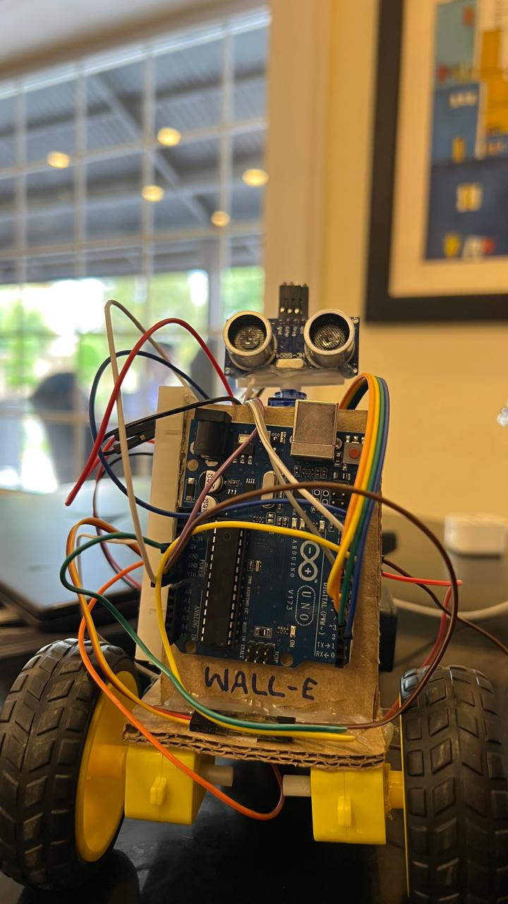
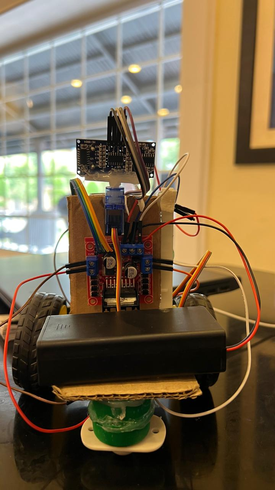

# Autonomous Obstacle-Avoiding Robot
**ATmega328P · Pure C · AVR-GCC · No Arduino Libraries**

An autonomous mobile robot that uses an HC-SR04 ultrasonic sensor mounted on an SG90 servo motor to continuously scan its surroundings and make real-time navigation decisions without human input. All firmware is written in pure C using direct AVR register manipulation — no Arduino libraries used anywhere.

Built as a final project for the Microprocessor Systems Lab at Military College of Signals, NUST (BEE 61, March 2026).

---

## Demo


---

## Photos




## Hardware Components

| Component | Qty | Purpose |
|---|---|---|
| Arduino Uno (ATmega328P) | 1 | Main microcontroller — 16MHz, 32KB Flash, 2KB SRAM |
| HC-SR04 Ultrasonic Sensor | 1 | Measures distance to obstacles (2–400cm range) |
| SG90 Servo Motor | 1 | Rotates sensor for left/right scanning (0–180°) |
| L298N Motor Driver Module | 1 | H-bridge for DC motor control (2A per channel) |
| DC Gear Motors | 2 | Drive the two main wheels (~200 RPM at 5V) |
| 18650 Li-ion Batteries | 2 | Power supply (3.7V each, 7.4V in series) |
| Rubber Wheels | 2 | Traction |
| Caster Wheel | 1 | Third contact point for stability |
| Cardboard Chassis | 1 | Structural base |

---

## Pin Mapping

| Arduino Pin | AVR Pin | Connected To | Direction |
|---|---|---|---|
| D12 | PB4 | HC-SR04 TRIG | OUTPUT |
| D8 | PB0 | HC-SR04 ECHO | INPUT |
| D10 | PB2 | SG90 Servo Signal | OUTPUT (Timer1 OC1B) |
| D6 | PD6 | L298N IN1 — Motor A | OUTPUT (Timer0 OC0A PWM) |
| D7 | PD7 | L298N IN2 — Motor A | OUTPUT (direction) |
| D5 | PD5 | L298N IN4 — Motor B | OUTPUT (Timer0 OC0B PWM) |
| D4 | PD4 | L298N IN3 — Motor B | OUTPUT (direction) |

---

## How It Works

### Sensor
The HC-SR04 is triggered by a 10µs pulse on the TRIG pin. It fires 8 ultrasonic bursts at 40kHz and the ECHO pin stays HIGH proportional to round-trip travel time. Loop iterations are counted while ECHO is HIGH and converted to cm using a tested calibration factor. Four readings are averaged with 25ms gaps to eliminate reflection noise.

### Servo Scanning
When an obstacle is detected, the servo rotates the sensor to 150° (left) and 30° (right) — not 180°/0° to avoid the servo arm hitting the chassis. Each scan waits 500ms for physical settling before taking a reading.

### Decision Logic

```
1. Measure front distance
2. If clear (> 16cm)  → move forward
3. If obstacle (≤ 16cm):
       → stop
       → scan left (150°) and right (30°)
       → re-center servo
       → reverse 500ms
       → turn toward the clearer side 700ms
       → repeat
```

### Motor Control
Differential steering — to turn, one motor reverses while the other drives forward. Both motors run at PWM duty cycle 230/255 (≈90%) to prevent wheel slip on the chassis and ensure straight-line motion.

---

## Timer Configuration

### Timer1 — Servo PWM (16-bit)
| Parameter | Value | Explanation |
|---|---|---|
| Mode | Fast PWM Mode 14 | ICR1 as TOP |
| Prescaler | /8 | Timer clock = 16MHz / 8 = 2MHz |
| ICR1 | 39999 | Period = 40,000 × (1/2MHz) = 20ms = 50Hz |
| Angle formula | OCR1B = 1000 + (angle × 4000 / 180) | Maps 0–180° to pulse range 1000–5000 |

### Timer0 — Motor PWM (8-bit)
| Parameter | Value | Explanation |
|---|---|---|
| Mode | Fast PWM Mode 3 | 0xFF as TOP |
| Prescaler | /64 | PWM frequency ≈ 977Hz |
| OCR0A | 230 | Left motor speed (≈90% duty cycle) |
| OCR0B | 230 | Right motor speed (≈90% duty cycle) |

---

## Key Design Decisions

| Parameter | Original | Final | Reason |
|---|---|---|---|
| SERVO_MIN | 600 | 1000 | 600 caused servo to bind at mechanical limit |
| SERVO_MAX | 2400 | 5000 | SG90 only reaches full 180° at 5000 counts |
| Safe distance | 20cm | 16cm | 20cm caused unnecessary stops in narrow spaces |
| Distance readings | Single | 4-sample average | Single readings gave ghost obstacles |
| Scan left angle | 160° | 150° | 160° hit the chassis frame |
| Scan right angle | 20° | 30° | 20° too close to chassis on right side |
| Motor PWM | 255 | 230 | 255 caused wheel slip on cardboard |
| Echo timeout | None | 120,000 count limit | Without it, lost echo caused permanent hang |

---

## Building and Flashing

### Requirements
- AVR-GCC toolchain
- AVRDUDE
- Arduino Uno or any ATmega328P board

### Compile
```bash
avr-gcc -mmcu=atmega328p -DF_CPU=16000000UL -O2 -o main.elf main.c
avr-objcopy -O ihex main.elf main.hex
```

### Flash
```bash
avrdude -c arduino -p m328p -P /dev/ttyUSB0 -b 115200 -U flash:w:main.hex
```
Replace `/dev/ttyUSB0` with your actual port (`COM3`, `COM4` etc. on Windows).

---

## Lab Concepts Applied (8051 → AVR)

This project directly translates concepts from 8051 Assembly lab work to the ATmega328P:

| Concept | 8051 Assembly | This Project (AVR C) |
|---|---|---|
| Port direction | Implicit (write 1 = input) | DDRx explicit register |
| Set pin HIGH | SETB P1.x | `PORTB \|= (1<<PBx)` |
| Set pin LOW | CLR P1.x | `PORTB &= ~(1<<PBx)` |
| Read pin | JB P1.x, label | `if (PINB & (1<<PBx))` |
| Timer mode | TMOD register | TCCRnA / TCCRnB registers |
| Timer value | TH0, TL0 | ICR1, OCRnx |
| Start timer | TR0 = 1 | CS bits in TCCRnB |
| Delay | DJNZ R0, loop | `_delay_ms()` / `_delay_us()` |
| Subroutine call | ACALL / LCALL | C function call |
| Return | RET | `return` / end of function |
| Infinite loop | SJMP $ | `while(1)` |
| PWM generation | Manual bit-bang only | Hardware via timer compare match |

---

## Project Structure

```
obstacle-avoiding-robot-avr/
├── Obstacle Avoiding Robot code (C language)          ← Complete firmware (pure C, AVR-GCC)
├── README.md       ← This file
├── LICENSE         ← MIT License
└── images/
    ├── robot_front.jpg
    ├── robot_side.jpg
    └── schematic.png
```

---


## License

This project is licensed under the MIT License — see [LICENSE](LICENSE) for details.
